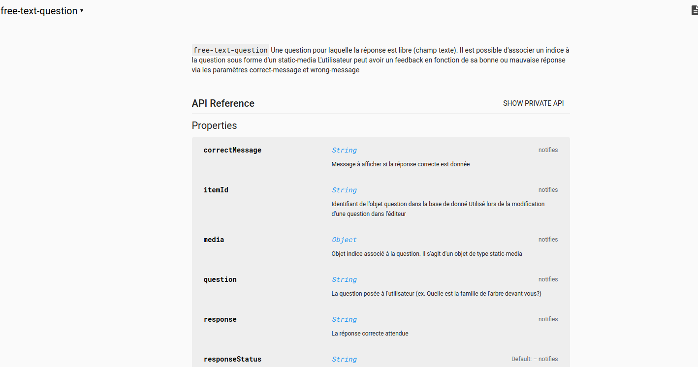

# Atelier TP MOGGLE

## Première partie : interface et page de démonstration d'un composant

Dans ce TP vous allez concevoir et implémenter diverses améliorations dans le fonctionnement du composant "free-text-question". Ce composant est disponible [à cette adresse](https://github.com/REVERIES-project/free-text-question).

* Se rendre sur la page du composant et consulter la page **documentation et démo** (lien situé en bas de la page principale)

* Cette page présente une **brève description du composant**, ainsi que **l'API publique exposée par ce dernier**.
  * Les **propriétés** (properties) correspondent aux *attributs html* qui peuvent être renseignés pour ce composant. Par exemple la propriété `question` est une chaine de caractère correspondant à la question qui sera affichée à l'utilisateur.
  * Les **méthodes** correspondent aux nouvelles fonctions que ce composant expose et que l'on peut appeler depuis l'extérieur.




* Se rendre sur la **page de démonstration** du composant. En haut à droite en cliquant sur l'icone démo. 


* Cette page de démonstration est divisée en deux parties :
  * Une **instance du composant** avec laquelle on peut interagir
  * Le **code correspondant à cette instance**, situé dans la partie inférieure. Ce code fournit un exemple direct d'utilisation du composant, plus efficace souvent que la documentation. 
  * Ici ce code est:

```html 
<free-text-question question="Quelle est la réponse?" response="dans la question" response-label="Entrez votre réponse" media="{&quot;mkdown&quot;:&quot;## La réponse est dans la question&quot;}" correct-message="Bravo vous êtes un individu remarquable" wrong-message="Non c'est faux, essayez encore et encore et encore"></free-text-question>
```

* En regardant le code de l'instance de démonstration, ou l'indice, **deviner la bonne réponse**. 
  * **Se montrer satisfait** si on devine correctement
  * **Cacher sa frustration** et essayer encore en cas de réponse incorrecte

## Deuxième partie : installer les sources du composant localement 

Rappel : la modification d'un composant de jeu sera refletée dans **l'editeur MOGGLE** (destiné aux concepteurs de jeux) et dans **MOGGLE Game player** (destiné aux joueurs). 

Les modifications que vous allez réaliser seront **uniquement en *localhost* sur votre session**. Pour qu'elles soient intégrées dans l'éditeur **vous auriez à réaliser une *pull request* que le/les propriétaires du repository accepteront**. L'utilisation de github sort du cadre de cet atelier, vous trouverez plus d'informations [ici](https://services.github.com/on-demand/github-cli/open-pull-request-github).


* Commencer par ouvrir une fenêtre terminal (Application/Terminal).
* **Créer un dossier Dev** pour l'atelier
    ```bash
     mkdir Dev
     cd Dev
     ```
* Depuis le dossier Dev, **effectuer un *git clone* du repository de *free-text-question*. Installer ensuite les *dépendances bower* du composant**
     ```bash
     git clone https://github.com/REVERIES-project/free-text-question.git
     cd free-text-question
     bower install 
     ```
* Le composant est **maintenant installé localement** et peut être **modifié et testé facilement. Lancer le serveur Polymer local**
     ```bash
    polymer serve
    ```
  * Cette commande affiche une réponse semblable à 

  ` info:    Files in this directory are available under the following URLs`
  
   `applications: http://127.0.0.1:8081`
  
   `reusable components: http://127.0.0.1:8081/components/free-text-question/`

* Ouvrir l'adresse correspondant à *reusable component* (ctrl + clic). Le navigateur Firefox s'ouvre à l'adresse donnée. **La page est la même que la page de *documentation/démo* de github**. Cependant vous **pouvez maintenant modifier le code et voir les modifications par un simple rafraichissement** du browser (F5).

* Lancer l'éditeur *Visual Studio Code* 
  * *Application/Dévelopement/Visual Studio Code*
  * Ouvrir le répertoire du composant : *Dev/free-text-question*


* L'interface de *Visual studio code* présente à gauche la liste des fichiers. Les fichiers qui vont nous intéresser pour le workshop sont *free-text-question.html* et *demo/index.html*


## Troisième partie : effectuer les améliorations

* On souhaite effectuer deux améliorations
  * Rendre la validation des réponses non sensible à la casse
  * Rendre la validation des réponses non sensible à la présence d'espace en début ou fin de réponse

### Amélioration 1 : réponses non sensibles à la casses

* Etudier le fonctionnement de la fonction **validate** dans *free-text-question.html*. 
  * En utilisant la fonction javascript native toLowerCase telle que
  ```javascript
  var x="Reponse"
  x.toLowerCase()==="reponse" //true
  ```
  modifier la fonction pour n'être pas sensible à la casse des réponse.
  * Vérifier que la modification fonctionne correctement via la page démo du composant. 
    * Il suffira d'entrer la réponse correcte avec une casse différente.

### Amélioration 2 : réponse non sensibles à la présence de *trailing space*

* Les *leading space* et *trailing space* sont des caractères de type *whitespace* (tab, espace, no-break space...) en début ou en fin de chaine de caractère. Ces caractères posent souvent problème et javascript propose une méthode native *trim* pour les faire disparaitre telle que
  ```javascript
  var x=" Reponse    "
  x.trim()==="reponse" //true
  ```
 * En utilisant la méthode *trim* modifier la méthode validate de façon à ne pas être sensible à la présence de *trailing space*

   * Vérifier que la modification fonctionne correctement via la page démo du composant. 
     * Il suffira d'entrer la réponse avec un espace à la fin.


  


